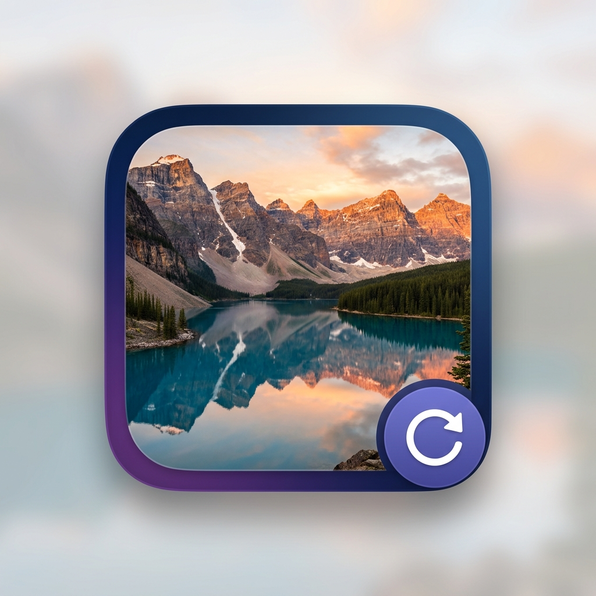

# DailyWalls

A lightweight, native macOS menu bar app that automatically downloads and sets your daily **Bing** or **Windows Spotlight** wallpaper — sourced directly from official Microsoft endpoints. No third-party dependencies.



---

## Features

- 🖼️ **Daily wallpapers** from Bing (up to 4K UHD) or Windows Spotlight (1920×1080), fetched from official Microsoft APIs
- 🔄 **Auto-refresh** on system wake and screen unlock — never while the computer sleeps
- 🗂️ **All Desktops & Spaces** — wallpaper applied across every screen and virtual desktop
- 💾 **Local cache** — images saved to `~/Pictures/ms-wallpapers/` with dated filenames
- 📋 **Daily logs** written to `~/.dailywalls/`
- 🌍 **Locale-aware** — Bing feed uses your system locale as the market (e.g. `en-US`, `zh-CN`, `de-DE`)
- ⚡ **Zero idle CPU/memory** — purely event-driven, no polling or background timers
- 🚫 **No Dock icon** — lives only in the menu bar

---

## Menu Bar Options

| Option | Description |
|---|---|
| **Bing** ✓ | Use today's Bing Image of the Day (mutually exclusive with Spotlight) |
| **Spotlight** | Use today's Windows Spotlight image (mutually exclusive with Bing) |
| **Refresh Now** | Force re-download and apply today's wallpaper immediately |
| **Exit** | Quit the app |

---

## Prerequisites

| Requirement | Version |
|---|---|
| macOS | 13.0 Ventura or later |
| Xcode Command Line Tools | 15.0 or later |
| Swift | 5.9 or later |

### Install Xcode Command Line Tools

If you don't have Xcode or the command line tools installed:

```bash
xcode-select --install
```

Verify your Swift version:

```bash
swift --version
# Should print: Apple Swift version 5.9 or later
```

---

## Download & Install (Pre-built)

Download the latest `.dmg` from the [Releases](https://github.com/Xiaohan-Tian/DailyWalls/releases) page — choose `arm64` for Apple Silicon (M1/M2/M3) or `x86_64` for Intel.

1. Open the `.dmg` and drag `DailyWalls.app` to the **Applications** folder
2. **macOS 15 Sequoia and later** — Apple blocks un-notarized apps by default. After copying the app, open **System Settings → Privacy & Security**, scroll down, and click **Open Anyway** next to DailyWalls.

   Or run this once in Terminal:
   ```bash
   xattr -dr com.apple.quarantine /Applications/DailyWalls.app
   ```
3. Launch from `/Applications/DailyWalls.app` — the icon appears in your menu bar

> This limitation exists because the app is not notarized (which requires a paid Apple Developer membership). The app itself is open source and safe to inspect.

---

## Build & Install

### 1. Clone the repository

```bash
git clone https://github.com/Xiaohan-Tian/DailyWalls.git
cd DailyWalls
```

### 2. Build and install in one step

```bash
./build.sh install
```

This will:
1. Compile the app with Swift (`release` configuration)
2. Assemble `DailyWalls.app` with the correct `Info.plist` and icon
3. Ad-hoc code-sign the bundle
4. Copy it to `/Applications/`
5. Launch the app automatically

> **First launch only:** macOS Gatekeeper will block an ad-hoc-signed app the first time.
> Right-click `DailyWalls.app` in `/Applications` → **Open** → click **Open** in the dialog.
> You only need to do this once.

### 3. Verify it's running

You should see the wallpaper icon (🏔️↻) in your menu bar. Check the log to confirm:

```bash
cat ~/.dailywalls/$(date +%Y-%m-%d).log
```

---

## Build Only (no install)

To build the `.app` bundle without installing:

```bash
./build.sh
# Output: ./DailyWalls.app
```

---

## Uninstall

```bash
# Quit the app first
pkill -x DailyWalls

# Remove the app
rm -rf /Applications/DailyWalls.app

# Optional: remove downloaded wallpapers
rm -rf ~/Pictures/ms-wallpapers

# Optional: remove logs
rm -rf ~/.dailywalls
```

---

## File Locations

| Path | Contents |
|---|---|
| `/Applications/DailyWalls.app` | The installed app |
| `~/Pictures/ms-wallpapers/bing/` | Downloaded Bing wallpapers |
| `~/Pictures/ms-wallpapers/spotlight/` | Downloaded Spotlight wallpapers |
| `~/.dailywalls/` | Daily log files (`yyyy-mm-dd.log`) |

### Wallpaper filename format

```
~/Pictures/ms-wallpapers/{bing|spotlight}/{yyyy-mm-dd}.jpg
```

Example: `~/Pictures/ms-wallpapers/bing/2026-06-03.jpg`

---

## How It Works

1. **On launch / wake / screen unlock** — the app checks if today's wallpaper has already been applied (via a stored date). If not, it fetches the latest image and downloads it.
2. **Switching sources (Bing ↔ Spotlight)** — immediately triggers a fresh download for the new source.
3. **Refresh Now** — always re-downloads and re-applies, regardless of cache state.
4. **Multi-space support** — uses both `NSWorkspace.setDesktopImageURL` (per connected screen) and an AppleScript fallback to cover all inactive Mission Control spaces.

---

## Project Structure

```
DailyWalls/
├── Package.swift                          # Swift Package Manager manifest
├── Info.plist                             # App bundle metadata (LSUIElement = YES)
├── build.sh                               # Build + package + install script
└── Sources/DailyWalls/
    ├── main.swift                         # NSApplication entry point
    ├── AppDelegate.swift                  # Menu bar icon, menu, system observers
    ├── WallpaperManager.swift             # Download + apply wallpaper logic
    ├── WallpaperAPI.swift                 # Microsoft Bing + Spotlight API client
    ├── Preferences.swift                  # UserDefaults wrapper
    ├── Logger.swift                       # Daily log file writer
    └── Resources/
        ├── AppIcon.png                    # App Finder icon (full-color)
        └── menubar_icon.png               # Menu bar icon (monochrome)
```

---

## Data Sources

Both sources are official Microsoft endpoints — no third-party services involved.

| Source | Endpoint | Resolution |
|---|---|---|
| **Bing** | `https://www.bing.com/HPImageArchive.aspx?format=js&idx=0&n=1&mkt={locale}` | Up to 3840×2160 UHD (`_UHD.jpg`) |
| **Spotlight** | `https://arc.msn.com/v3/Delivery/Placement?pid=338387&…` | 1920×1080 (Microsoft CDN) |

- **Bing** uses the same JSON API that powers the Bing homepage, with your system locale as the market (e.g. `en-US`).
- **Spotlight** uses the same delivery endpoint that Windows uses for its lock screen images.

---

## License

MIT
